# Claude Code PM

[](https://automaze.io)
 
[](https://github.com/automazeio/ccpm/blob/main/README.md)
[](https://github.com/automazeio/ccpm)
 
[](https://github.com/automazeio/ccpm/blob/main/LICENSE)
 
[](http://x.com/intent/follow?screen_name=aroussi)
 
[](https://github.com/automazeio/ccpm)

### Claude Code 工作流程使用 spec-driven development、GitHub issues、Git worktrees 和多个并行运行的 AI agents 来更~~快~~_好_地交付。

停止丢失 context。停止任务阻塞。停止交付 bugs。这个经过实战检验的系统将 PRDs 转为 epics，epics 转为 GitHub issues，issues 转为生产代码 - 每一步都有完整的可追溯性。


## 目录

- [背景](#背景)
- [工作流程](#工作流程)
- [与众不同之处](#与众不同之处)
- [为什么选择 GitHub Issues？](#为什么选择-github-issues)
- [核心原则：禁止随性编码](#核心原则禁止随性编码)
- [系统架构](#系统架构)
- [工作流程阶段](#工作流程阶段)
- [命令参考](#命令参考)
- [并行执行系统](#并行执行系统)
- [关键功能和优势](#关键功能和优势)
- [证实效果](#证实效果)
- [示例流程](#示例流程)
- [立即开始](#立即开始)
- [本地 vs 远程](#本地-vs-远程)
- [技术说明](#技术说明)
- [支持此项目](#支持此项目)

## 背景

每个团队都在与相同的问题作斗争：
- **Context 在会话间蒸发**，强制持续重新发现
- **并行工作产生冲突**，当多个开发者接触相同代码时
- **需求漂移**，口头决定覆盖书面规范
- **进度变得不可见**，直到最后阶段

此系统解决了所有这些问题。

## 工作流程

```mermaid
graph LR
    A[PRD 创建] --> B[Epic 规划]
    B --> C[任务分解]
    C --> D[GitHub 同步]
    D --> E[并行执行]
```



### 实际演示（60秒）

```bash
# 通过引导式头脑风暴创建全面 PRD
/pm:prd-new memory-system

# 将 PRD 转换为带任务分解的技术 epic
/pm:prd-parse memory-system

# 推送到 GitHub 并开始并行执行
/pm:epic-oneshot memory-system
/pm:issue-start 1235
```

## 与众不同之处

| 传统开发 | Claude Code PM 系统 |
|------------------------|----------------------|
| 会话间丢失 context | **持久 context** 贯穿所有工作 |
| 串行任务执行 | 独立任务的**并行 agents** |
| 基于记忆的"随性编码" | **Spec-driven** 具有完整可追溯性 |
| 进度隐藏在 branches 中 | GitHub 中的**透明审计跟踪** |
| 手动任务协调 | 使用 `/pm:next` 的**智能优先级** |

## 为什么选择 GitHub Issues？

大多数 Claude Code 工作流程在隔离中操作 - 单个开发者在本地环境中与 AI 协作。这造成一个根本问题：**AI 辅助开发变成孤岛**。

通过使用 GitHub Issues 作为我们的数据库，我们释放了强大的功能：

### 🤝 **真正的团队协作**
- 多个 Claude 实例可以同时在同一项目上工作
- 人类开发者通过 issue 评论实时看到 AI 进度
- 团队成员可以在任何地方加入 - context 始终可见
- 管理者获得透明度而不中断流程

### 🔄 **无缝人机交接**
- AI 可以开始任务，人类可以完成（或反之）
- 进度更新对所有人可见，不被困在聊天记录中
- 代码审查通过 PR 评论自然进行
- 没有"AI 做了什么？"会议

### 📈 **超越独立工作的可扩展性**
- 无摩擦添加团队成员
- 多个 AI agents 并行处理不同 issues
- 分布式团队自动保持同步
- 与现有 GitHub 工作流程和工具配合

### 🎯 **单一真相来源**
- 无需单独的数据库或项目管理工具
- Issue 状态就是项目状态
- 评论是审计跟踪
- 标签提供组织

这不只是项目管理系统 - 这是一个**协作协议**，让人类和 AI agents 大规模协作，使用你的团队已经信任的基础设施。

## 核心原则：禁止随性编码

> **每一行代码都必须追溯到规范。**

我们遵循严格的5阶段纪律：

1. **🧠 头脑风暴** - 比舒适度更深入地思考
2. **📝 文档** - 编写不留解释余地的规范
3. **📐 规划** - 用明确技术决策进行架构设计
4. **⚡ 执行** - 准确构建规范内容
5. **📊 跟踪** - 每一步保持透明进度

无捷径。无假设。无遗憾。

## 系统架构

```
.claude/
├── CLAUDE.md          # 常驻指令（将内容复制到项目的 CLAUDE.md 文件）
├── agents/            # 面向任务的 agents（用于 context 保存）
├── commands/          # 命令定义
│   ├── context/       # 创建、更新和启动 context
│   ├── pm/            # ← 项目管理命令（此系统）
│   └── testing/       # 启动和执行测试（编辑此项）
├── context/           # 项目范围 context 文件
├── epics/             # ← PM 的本地工作空间（放入 .gitignore）
│   └── [epic-name]/   # Epic 和相关任务
│       ├── epic.md    # 实现计划
│       ├── [#].md     # 个人任务文件
│       └── updates/   # 进行中更新
├── prds/              # ← PM 的 PRD 文件
├── rules/             # 放置你想引用的任何规则文件
└── scripts/           # 放置你想使用的任何脚本文件
```

## 工作流程阶段

### 1. 产品规划阶段

```bash
/pm:prd-new feature-name
```
启动全面头脑风暴来创建产品需求文档，捕获愿景、用户故事、成功标准和约束。

**输出：** `.claude/prds/feature-name.md`

### 2. 实现规划阶段

```bash
/pm:prd-parse feature-name
```
将 PRD 转换为带架构决策、技术方法和依赖映射的技术实现计划。

**输出：** `.claude/epics/feature-name/epic.md`

### 3. 任务分解阶段

```bash
/pm:epic-decompose feature-name
```
将 epic 分解为带验收标准、工作量估计和并行化标志的具体可操作任务。

**输出：** `.claude/epics/feature-name/[task].md`

### 4. GitHub 同步

```bash
/pm:epic-sync feature-name
# 或者对于有信心的工作流程：
/pm:epic-oneshot feature-name
```
将 epic 和任务作为 issues 推送到 GitHub，带适当标签和关系。

### 5. 执行阶段

```bash
/pm:issue-start 1234  # 启动专门 agent
/pm:issue-sync 1234   # 推送进度更新
/pm:next             # 获取下一优先级任务
```
专门 agents 实现任务，同时维护进度更新和审计跟踪。

## 命令参考

> [!TIP]
> 键入 `/pm:help` 获取简洁命令摘要

### 初始设置
- `/pm:init` - 安装依赖并配置 GitHub

### PRD 命令
- `/pm:prd-new` - 启动新产品需求头脑风暴
- `/pm:prd-parse` - 将 PRD 转换为实现 epic
- `/pm:prd-list` - 列出所有 PRDs
- `/pm:prd-edit` - 编辑现有 PRD
- `/pm:prd-status` - 显示 PRD 实现状态

### Epic 命令
- `/pm:epic-decompose` - 将 epic 分解为任务文件
- `/pm:epic-sync` - 将 epic 和任务推送到 GitHub
- `/pm:epic-oneshot` - 一个命令中分解和同步
- `/pm:epic-list` - 列出所有 epics
- `/pm:epic-show` - 显示 epic 及其任务
- `/pm:epic-close` - 标记 epic 完成
- `/pm:epic-edit` - 编辑 epic 详情
- `/pm:epic-refresh` - 从任务更新 epic 进度

### Issue 命令
- `/pm:issue-show` - 显示 issue 和子 issues
- `/pm:issue-status` - 检查 issue 状态
- `/pm:issue-start` - 用专门 agent 开始工作
- `/pm:issue-sync` - 将更新推送到 GitHub
- `/pm:issue-close` - 标记 issue 完成
- `/pm:issue-reopen` - 重新打开已关闭 issue
- `/pm:issue-edit` - 编辑 issue 详情

### 工作流程命令
- `/pm:next` - 显示带 epic context 的下一优先级 issue
- `/pm:status` - 整体项目仪表板
- `/pm:standup` - 每日站会报告
- `/pm:blocked` - 显示被阻塞任务
- `/pm:in-progress` - 列出进行中工作

### 同步命令
- `/pm:sync` - 与 GitHub 完全双向同步
- `/pm:import` - 导入现有 GitHub issues

### 维护命令
- `/pm:validate` - 检查系统完整性
- `/pm:clean` - 归档完成工作
- `/pm:search` - 搜索所有内容

## 并行执行系统

### Issues 不是原子的

传统思维：一个 issue = 一个开发者 = 一个任务

**现实：一个 issue = 多个并行工作流**

单个"实现用户认证" issue 不是一个任务。它是...

- **Agent 1**：数据库表和迁移
- **Agent 2**：服务层和业务逻辑
- **Agent 3**：API 端点和中间件
- **Agent 4**：UI 组件和表单
- **Agent 5**：测试套件和文档

全部在同一个 worktree 中**同时**运行。

### 速度的数学

**传统方法：**
- 有3个 issues 的 Epic
- 串行执行

**此系统：**
- 相同的有3个 issues 的 epic
- 每个 issue 分为~4个并行流
- **12个 agents 同时工作**

我们不是将 agents 分配给 issues。我们**利用多个 agents**更快交付。

### Context 优化

**传统单线程方法：**
- 主对话承载所有实现细节
- Context window 填满数据库schemas、API 代码、UI 组件
- 最终达到 context 限制并失去连贯性

**并行 agent 方法：**
- 主线程保持清洁和战略性
- 每个 agent 在隔离中处理自己的 context
- 实现细节从不污染主对话
- 主线程保持监督而不淹没在代码中

你的主对话成为指挥家，而不是管弦乐队。

### GitHub vs 本地：完美分离

**GitHub 看到的：**
- 干净、简单的 issues
- 进度更新
- 完成状态

**本地实际发生的：**
- Issue #1234 爆发为5个并行 agents
- Agents 通过 Git commits 协调
- 复杂编排隐藏在视野外

GitHub 不需要知道工作如何完成 - 只需要知道已完成。

### 命令流程

```bash
# 分析可以并行化的内容
/pm:issue-analyze 1234

# 启动集群
/pm:epic-start memory-system

# 观看魔法
# 12个 agents 跨3个 issues 工作
# 全部在：../epic-memory-system/

# 完成时一次干净合并
/pm:epic-merge memory-system
```

## 关键功能和优势

### 🧠 **Context 保存**
再也不会丢失项目状态。每个 epic 维护自己的 context，agents 从 `.claude/context/` 读取，同步前本地更新。

### ⚡ **并行执行**
多个 agents 同时工作更快交付。标记为 `parallel: true` 的任务启用无冲突并发开发。

### 🔗 **GitHub Native**
与你团队已使用的工具配合。Issues 是真相来源，评论提供历史，无依赖 Projects API。

### 🤖 **Agent 专业化**
每项工作的正确工具。UI、API 和数据库工作的不同 agents。每个读取需求并自动发布更新。

### 📊 **完整可追溯性**
每个决策都有文档。PRD → Epic → Task → Issue → Code → Commit。从想法到生产的完整审计跟踪。

### 🚀 **开发者生产力**
专注于构建，而不是管理。智能优先级、自动 context 加载和就绪时增量同步。

## 证实效果

使用此系统的团队报告：
- **减少89%时间**丢失在 context 切换 - 你将大大减少使用 `/compact` 和 `/clear`
- **5-8个并行任务** vs 之前1个 - 同时编辑/测试多个文件
- **减少75%** bug 率 - 由于将功能分解为详细任务
- **最多快3倍**功能交付 - 基于功能大小和复杂性

## 示例流程

```bash
# 开始新功能
/pm:prd-new memory-system

# 审查和完善 PRD...

# 创建实现计划
/pm:prd-parse memory-system

# 审查 epic...

# 分解为任务并推送到 GitHub
/pm:epic-oneshot memory-system
# 创建 issues：#1234（epic）、#1235、#1236（任务）

# 开始任务开发
/pm:issue-start 1235
# Agent 开始工作，维护本地进度

# 同步进度到 GitHub
/pm:issue-sync 1235
# 更新作为 issue 评论发布

# 检查整体状态
/pm:epic-show memory-system
```

## 立即开始

### 快速设置（2分钟）

1. **将此 repository 安装到你的项目**：

   #### Unix/Linux/macOS

   ```bash
   cd path/to/your/project/
   curl -sSL https://raw.githubusercontent.com/automazeio/ccpm/main/ccpm.sh | bash
   # 或：wget -qO- https://raw.githubusercontent.com/automazeio/ccpm/main/ccpm.sh | bash
   ```

   #### Windows (PowerShell)
   ```bash
   cd path/to/your/project/
   iwr -useb https://raw.githubusercontent.com/automazeio/ccpm/main/ccpm.bat | iex
   ```
   > ⚠️ **重要**：如果你已有 `.claude` 目录，将此 repository 克隆到不同目录并复制克隆 `.claude` 目录的内容到你项目的 `.claude` 目录。

   在[安装指南 ›](https://github.com/automazeio/ccpm/tree/main/install)查看完整/其他安装选项


2. **初始化 PM 系统**：
   ```bash
   /pm:init
   ```
   此命令将：
   - 安装 GitHub CLI（如需要）
   - 通过 GitHub 认证
   - 安装 [gh-sub-issue extension](https://github.com/yahsan2/gh-sub-issue) 用于正确父子关系
   - 创建必需目录
   - 更新 .gitignore

3. **创建 `CLAUDE.md`** 包含你的 repository 信息
   ```bash
   /init include rules from .claude/CLAUDE.md
   ```
   > 如果你已有 `CLAUDE.md` 文件，运行：`/re-init` 用 `.claude/CLAUDE.md` 的重要规则更新它。

4. **启动系统**：
   ```bash
   /context:create
   ```


### 开始你的第一个功能

```bash
/pm:prd-new your-feature-name
```

观看结构化规划转换为交付代码。

## 本地 vs 远程

| 操作 | 本地 | GitHub |
|-----------|-------|--------|
| PRD 创建 | ✅ | — |
| 实现规划 | ✅ | — |
| 任务分解 | ✅ | ✅ (同步) |
| 执行 | ✅ | — |
| 状态更新 | ✅ | ✅ (同步) |
| 最终可交付成果 | — | ✅ |

## 技术说明

### GitHub 集成
- 使用 **gh-sub-issue extension** 实现正确父子关系
- 如果未安装扩展则回退到任务列表
- Epic issues 自动跟踪子任务完成
- 标签提供额外组织（`epic:feature`、`task:feature`）

### 文件命名约定
- 任务在分解期间以 `001.md`、`002.md` 开始
- GitHub 同步后，重命名为 `{issue-id}.md`（如 `1234.md`）
- 使导航容易：issue #1234 = 文件 `1234.md`

### 设计决策
- 故意避免 GitHub Projects API 复杂性
- 所有命令首先在本地文件上操作以提高速度
- 与 GitHub 的同步是明确和受控的
- Worktrees 为并行工作提供干净的 git 隔离
- GitHub Projects 可以单独添加用于可视化

---

## 支持此项目

Claude Code PM 由 [Automaze](https://automaze.io) 开发，**为交付者开发，由交付者开发**。

如果 Claude Code PM 帮助你的团队交付更好的软件：

- ⭐ **[为此 repository 加星](https://github.com/automazeio/ccpm)** 以显示你的支持
- 🐦 **[在 X 上关注 @aroussi](https://x.com/aroussi)** 获取更新和技巧


---

> [!TIP]
> **使用 Automaze 更快交付。** 我们与创始人合作实现他们的愿景，扩展业务，并优化成功。
> **[访问 Automaze 与我预约通话 ›](https://automaze.io)**

---

## Star History

